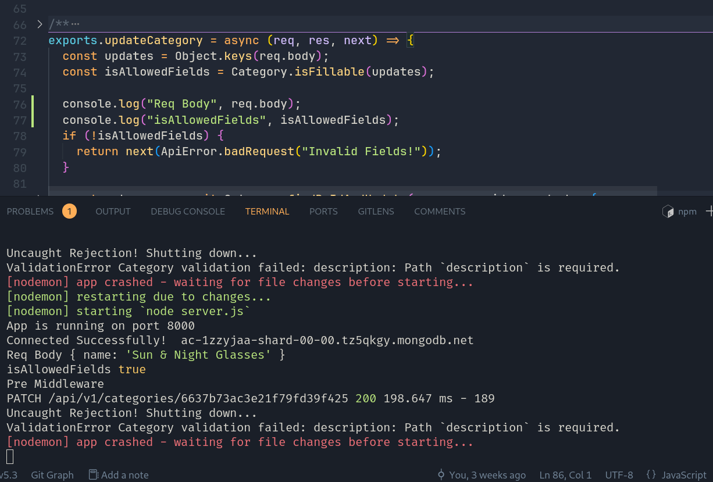

We can do more refactor

1. instead do rule for each route, we can do it based on logic

getSingleCategoryRule
getSingleProductRule

->

getSingleRule

<!--  -->

learn how to create catchAsync function
learn how to create AppError class
learn how to create handlerFactory function

see jonas code for reference (in github)
[code](https://github.com/sdmisra/SchmedtmannNodeCourse/blob/main/4-natours/after-section-14/controllers/userController.js)

[code](https://github.com/Boghdady/udemy-build-ecommerce-api-using-nodejs/blob/master/services/handlersFactory.js)

<!--  -->

What is `nested routes`
What is `populate` in mongoose
What is `mergeParams` in express router

<!--  -->

There is a small problem in Error Handling in Middlewares and Express Validators
it is returning 400 status code in message "Brand not found", "SubCategory not found"

and that because throwing an error in the middleware will be caught by the error handler another middleware (doValidate)

i will plan to fix that - insha'allah - in the next commit

### with just Async Handling

if async error occurs, app will crash

if you use AsyncHandler, it will catch the error and pass it to the error handler middleware

if you use catchAsync, it will catch the error and pass it to the error handler middleware

---

save images after validation (save file name in req.body but not saved in machine), another middleware after validation layer will save the image in the machine
