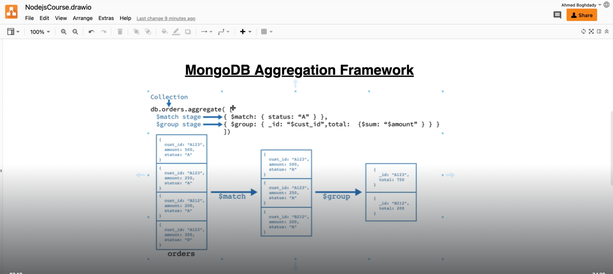

aggregate framework in mongoose:

```js
db.collection.aggregate(stages);

// stages => is an array of stages (phases) which you want to data go through

// for example
db.collection.aggregate([
    { $match: { $gt: { gpa: 3.5 } } } // filteration
]); // will return the documents that match this criteria

db.orders.aggregate([
    { $match: { status: "approved" } }, // filteration
    { $group: { _id: "$customer_id", total: { $sum: { "$amount_checkout" }} } }
]); // return total checkout amount for each customer (may one customer order multiple orders for different products - or same)
```
