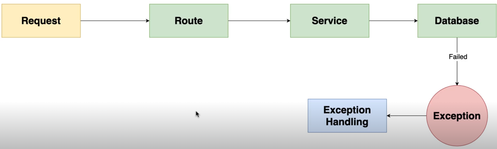

# Validation Layer

The validation layer is a set of functions that are used to validate the data that is being sent to the server. This is important because it ensures that the data is in the correct format and that it is safe to use. The validation layer is used to check the data before it is processed by the server, and it can help to prevent errors and security vulnerabilities.

for example, if you send incorrect ID (ObjectID) to the server, you will pass it directly to the database, and it will throw an error. To prevent this, you can use the validation layer to check if the ID is in the correct format before sending it to the database.



## real example

we want create a validation middleware for checking ObjectID if it is valid or not before go into database.

```javascript
const { Types } = require("mongoose");

const validateObjectId = (req, res, next) => {
  const { id } = req.params;
  if (!Types.ObjectId.isValid(id)) {
    return res.status(400).send("Invalid ID.");
  }

  next();
};
```


try to do your best catching errors before go to the database/filesystem or any other external services.

because I/O of these services is expensive and you don't want to waste your resources on invalid data.

I/O operations of Accessing RAM is so much faster(10e-9) than accessing the disk(10e-3) or network(10e-6).

## Joi

Joi is a popular library that is used to validate data in Node.js applications. It provides a simple and easy-to-use API for defining validation rules and checking data against those rules. Joi is widely used in the Node.js community and is a great choice for validating data in your applications.

```

```

Summary

